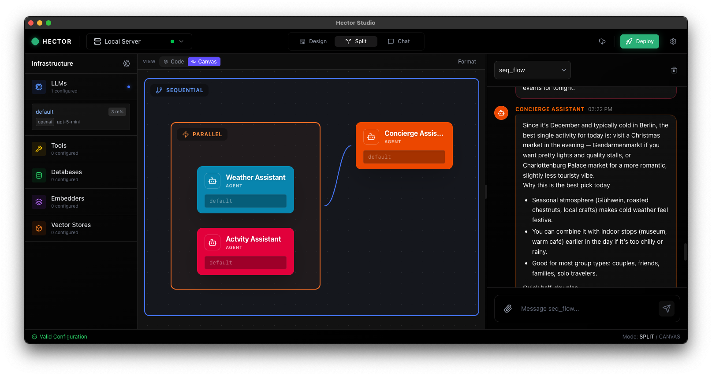

# Hector Studio

**Hector Studio** is the official graphical user interface (GUI) for **[Hector](https://github.com/verikod/hector)**, designed to provide a seamless and intuitive experience for interacting with your Hector agents and workflows. Built with Electron, React, and TypeScript, it offers a powerful desktop environment for managing your AI operations.



## Features

- **Desktop Native**: Fast and responsive application for macOS, Windows, and Linux.
- **Hector Integration**: Connects directly to your local or remote Hector instance.
- **Agent Management**: Visualize and control your Hector agents with ease.
- **Interactive Chat**: communicate with your agents through a rich chat interface.

## Documentation

For comprehensive documentation, please visit the [Hector Studio Documentation](https://gohector.dev/guides/studio).

## Quick Start

1. **Install Hector**:
    ```bash
    go install github.com/verikod/hector/cmd/hector@latest
    ```

2. **Start Hector in Studio Mode**:
   Enable the Studio API. For detailed instructions, please refer to the [Studio Configuration Guide](https://gohector.dev/guides/studio).
    ```bash
    hector serve --config myagents.yaml --studio
    ```

3. **Connect**:
   Open Hector Studio and connect to your local instance (usually `http://localhost:8080`).

## Authentication & Security

Hector Studio connects to your Hector instance. Ensure your Hector instance is secured.
For detailed configuration on authentication and security, please refer to the [Hector Security Documentation](https://gohector.dev/guides/security/).

## Installation

Download the latest release for your operating system from the [Releases](https://github.com/verikod/hector-studio/releases) page.

### macOS

1. Download the `.dmg` file and drag Hector Studio to your Applications folder.
2. On first launch, macOS may show a security warning because the app is not signed. Run the following command to allow it:
   ```bash
   xattr -cr /Applications/Hector\ Studio.app
   ```

### Windows

1. Download and run the `.exe` installer.
2. If Windows SmartScreen shows "Windows protected your PC", click **More info** → **Run anyway**.

### Linux

1. Download the `.AppImage` or `.deb` package.
2. For AppImage, make it executable and run:
   ```bash
   chmod +x hector-studio-*.AppImage
   ./hector-studio-*.AppImage
   ```

## License

This project is dual-licensed:

- **AGPL**: For open source use.
- **Commercial**: Commercial companies should ask for a license to use Hector Studio
